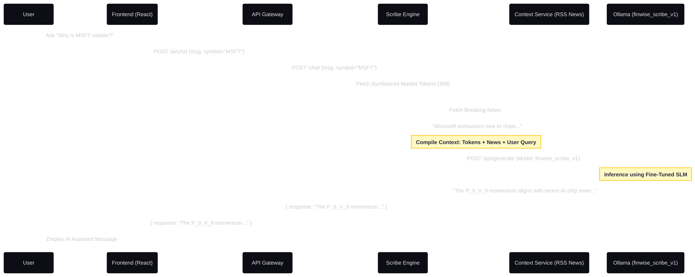

# 🧠 Finwise Scribe: Neuro-Symbolic AI for Market Forecasting on Edge Hardware


**Finwise Scribe** is an experimental, event-driven financial reasoning engine and interactive dashboard developed as a Master's Thesis project. It fundamentally rethinks how Large Language Models (LLMs) interact with financial time-series data to democratize institutional-grade market analysis. 🚀

---

## 🎯 1. Project Purpose & Executive Summary

### What does Finwise Scribe do?
Financial markets produce massive amounts of continuous, noisy data. Retail investors and researchers often struggle to distinguish between normal volatility and structural momentum shifts. **Finwise Scribe acts as an AI-powered financial analyst.** It ingests raw market data, translates it into a structured semantic language, and provides humans with deterministic, easy-to-understand trading narratives (e.g., "Bullish Shift", "Volatility Warning").

### Why was it built? (The Thesis Objective)
1. **Eliminate Math Hallucinations in AI:** Standard LLMs cannot reliably predict numerical prices. Scribe solves this by teaching the AI a custom Neuro-Symbolic "token" language instead of floating-point math.
2. **Decentralize Financial AI (Edge Computing):** Instead of relying on expensive cloud GPUs (like ChatGPT or Bloomberg GPT), Scribe is engineered to run a highly optimized, quantized Small Language Model (SLM) on consumer-grade **Edge Hardware (4GB VRAM)** without sacrificing analytical depth.

---

## 📑 Table of Contents
1. [Project Purpose & Executive Summary](#1-project-purpose--executive-summary)
2. [The Frontend Experience (UI/UX)](#2-the-frontend-experience-uiux)
3. [Core Innovation: The Neuro-Symbolic Engine](#3-core-innovation-the-neuro-symbolic-engine)
4. [System Architecture & Data Flow](#4-system-architecture--data-flow)
5. [MLOps: The Shadow Mode Experiment](#5-mlops-the-shadow-mode-experiment)
6. [Database & Entity Relationships](#6-database--entity-relationships)
7. [Local Deployment & Edge Optimization](#7-local-deployment--edge-optimization)
8. [API Reference & Execution Flows](#8-api-reference--execution-flows)
9. [Future Work & Enterprise Roadmap](#9-future-work--enterprise-roadmap)

---

## 💻 2. The Frontend Experience (UI/UX)

The user interacts with the Scribe Engine through a modern, highly responsive **React Single Page Application (SPA)** built with Vite and Tailwind CSS. The frontend is designed to handle asynchronous AI latency gracefully.

### Key Features of the Dashboard:
* ⏳ **Asynchronous Polling Engine:** When a user requests a stock analysis, the AI inference can take 10-30 seconds. Instead of freezing the browser, the UI receives a `task_id` and displays a dynamic progress state, polling the API in the background until the Celery worker finishes the job.
* 📈 **Interactive Market Visualization:** Displays historical OHLCV data alongside the technical indicators (RSI, MACD) calculated by the backend.
* 🧠 **Neuro-Symbolic Translator:** Visually breaks down the AI's "thought process." It shows the user the exact 10x10 Matrix Token (e.g., `P_8_V_9`) the LLM generated and translates it into a human-readable synthesized narrative.
* 🚨 **Shadow Mode Divergence Badges:** If the SLM predicts a sudden market reversal that traditional math (LSTM) missed, the UI highlights this discrepancy with an `OPPORTUNITY_ALERT` or `RISK_ALERT` badge.

---

## 💡 3. Core Innovation: The Neuro-Symbolic Engine

The pipeline transforms raw data into actionable JSON insights through four distinct phases:

### 🗄️ Phase I: The Native Data Layer
Technical indicators (RSI-14, MACD, SMA-50) are calculated using native `pandas.rolling()` methods. This completely eliminates the `numpy 2.0` binary conflicts caused by heavily abstracted libraries like `pandas-ta`.

### 🔢 Phase II: Symbolization (The 10x10 Quantile Matrix)
Raw OHLCV data is parsed into a **10x10 Decile Matrix**. Daily percentage changes in Price and Volume are bucketed into deciles (0 to 9) based on historical distribution.
* **Mechanism:** A day landing in the top 10% of historical price returns and the bottom 10% of volume is tokenized discretely as `P_9_V_0`.

### 🔮 Phase III: Sequence Prediction (Raw Completion)
A custom Low-Rank Adaptation (LoRA) fine-tuned model (`finwise_scribe_v1.gguf`) processes the symbolic sequence (e.g., `P_1_V_9 P_6_V_2 P_8_V_9...`). 
* **Determinism:** The LLM operates in strict **Few-Shot / Raw Completion** mode with `temperature=0.0` and `top_k=1`. It autoregressively computes the most mathematically probable next token without generating creative, hallucinated text.

### 🧩 Phase IV: Output Parsing
A Python-layer parser intercepts the raw token, evaluates corresponding technical constraints, and synthesizes a structured JSON response (Signal, Confidence, Reasoning) for the React frontend.

---

## 🏗️ 4. System Architecture & Data Flow

To prevent heavy GPU inference tasks from blocking the API or the UI, the system employs an **Asynchronous Event-Driven Architecture**.

### 📊 High-Level Architecture Diagram

[](./docs/architecture.svg)

### ⚙️ Component Breakdown
* **API Gateway (FastAPI/AsyncPG):** Non-blocking I/O gateway handling Auth, Rate Limiting, and returning immediate HTTP 202 responses for task tracking.
* **Message Broker & Queue (Redis + Celery):** Implements a "Fire-and-Forget" task distribution system.
* **Inference Node (Ollama):** Serves the GGUF model directly via local GPU, kept continuously in memory (`OLLAMA_KEEP_ALIVE`) to eliminate 20-second cold-start latency.
* **Observability (MLflow/Loki/Grafana):** Tracks Shadow Mode metrics and exact LLM prompts.

---

## 🕵️‍♂️ 5. MLOps: The Shadow Mode Experiment

This project is inherently an academic experiment. To prove the efficacy of the Neuro-Symbolic LLM against traditional quantitative models, a **Shadow Deployment** runs continuously.

### ⚙️ Event-Driven Forecast Sequence Diagram
[](./docs/sequence_diagram.svg)

### 📉 Divergence Tracking
1. **The Control:** A deterministic LSTM calculates basic momentum.
2. **The Challenger:** The Neuro-Symbolic SLM predicts the next semantic state.
3. **The Metric:** If the SLM predicts a severe trend reversal while the LSTM remains stable, MLflow logs an `is_divergent = 1` flag. This allows for rigorous thesis backtesting of the SLM's "early warning" capabilities.

---

## 🗄️ 6. Database & Entity Relationships

The PostgreSQL database is optimized for asynchronous read/writes.

### 🗂️ Entity-Relationship (ER) Schema
[](./docs/database.svg)

### 🧩 Object-Oriented Class Diagram
[](./docs/class_diagram.svg)

---

## ⚙️ 7. Local Deployment & Edge Optimization

### 📌 Prerequisites
* Docker Desktop (v4.20+)
* NVIDIA Container Toolkit (Required for GPU pass-through)

### 🛠️ Build & Run
**1. Clone the repository:**
```bash
git clone [https://github.com/MuhammetAliVarlik/FinwiseBackend.git](https://github.com/MuhammetAliVarlik/FinwiseBackend.git)
cd finwise-scribe
```

2. **Launch the Microservices:**

    ```bash
    docker-compose up -d --build
    
    ```
    *Architectural Note: Uvicorn's `--reload` flag is intentionally disabled in the `docker-compose.yml` to prevent `OS Error 12` (Memory Allocation Failure).*

3. **Initialize the Custom Inference Model (First Time Only):**

    ```bash
    docker exec -it finwise_ollama ollama create finwise_scribe_v1 -f /models/Modelfile
    ```

4. **Access the Dashboards:**

- **💻 React UI** `http://localhost:3000`

- **📖 API Docs:** `http://localhost:8000/docs`

- **📊 MLflow:** `http://localhost:5000`

---

## 📡 8. API Reference & Execution Flows

### A. The Forecast Endpoint (Neuro-Symbolic Engine)
**POST** `/api/v1/forecast/predict`
```json
{
  "symbol": "MSFT"
}
```
**Response (HTTP 200 - Parsed Output)**
```json
{
  "prediction": "P_SURGE_V_HIGH",
  "confidence": 0.85,
  "reasoning": "Sequence model predicts a bullish shift (Token: P_8_V_9). Technical indicators show RSI at 55.61 (NEUTRAL).",
  "divergence": "OPPORTUNITY_ALERT",
  "shadow_baseline": {
    "prediction_token": "P_STABLE_V_MID"
  }
}
```
### B. The Chat Endpoint (Context-Aware Inference)
Uses the Fine-Tuned SLM alongside Retrieval-Augmented Generation (RAG) to discuss market conditions interactively.

### 💬 Chat & Context Retrieval Sequence Diagram
[](./docs/sequence_chat.svg)

**POST** `/api/v1/chat`
```json
{
  "message": "Why is MSFT volatile?",
  "symbol": "MSFT"
}
```

---

## 🔮 Roadmap & Future Work (Thesis Outlook)

While the current MVP operates on a localized Docker Compose stack for Edge inference, the target Enterprise Architecture includes:

- **Continuous Training (CT):** Implementing an **Apache Airflow** DAG to automatically pull new market data, retrain the LoRA weights on cloud GPUs, and push the updated GGUF to the Edge.

- **Data Lake Integration:** Migrating from direct API fetches to an Apache Kafka + MinIO pipeline for real-time tick data processing.

- **Kubernetes Orchestration:** Deploying via `k3s` for horizontal scaling of the Celery workers.

---