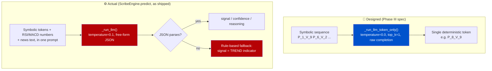
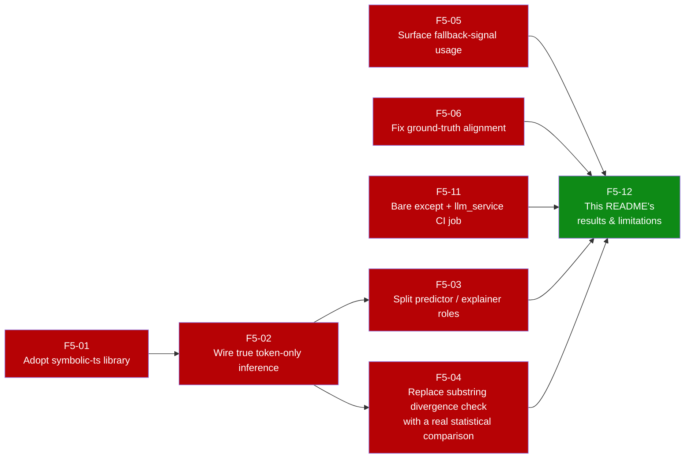

# 🧠 Finwise Scribe: Neuro-Symbolic AI for Market Forecasting on Edge Hardware


**Finwise Scribe** is an experimental, event-driven financial reasoning engine and interactive dashboard developed as a Master's Thesis project. It fundamentally rethinks how Large Language Models (LLMs) interact with financial time-series data to democratize institutional-grade market analysis. 🚀

## Recent Updates

### April 2026 — Correctness & Data Integrity Pass
This project is a Master's Thesis application, so a wrong number is worse than a missing feature. This pass went through the prediction and evaluation path looking specifically for places where the system could silently produce a misleading result, and fixed what it found:

- **Removed synthetic market-data fallback.** `StockService` used to fabricate a plausible-looking price history when a data provider failed, so a forecast could run on data that was never real. It now chains real providers only (Stooq → yfinance) and fails the request explicitly if none return data, instead of quietly inventing candles.
- **Fixed a label-mapping bug that flipped signals.** `normalize_direction_label` checked volume descriptors before price descriptors, so a composite token like `P_CRASH_V_HIGH` (bearish price move, high volume) was being canonicalized as `BULLISH` — the opposite of what the token encodes. Price-side prefixes are now checked first, with regression tests locking in `P_SURGE_V_HIGH`, `P_CRASH_V_HIGH`, and `P_STABLE_V_MID`.
- **Fixed a falsy-value bug in evaluation parameter loading.** `evaluation_service.py` read MLflow run parameters with `run.get(key) or run.get(fallback)` — but MLflow returns `NaN` for a missing parameter, and `NaN` is truthy in Python, so the fallback branch never ran when it should have. Replaced with explicit `pd.notna()` checks.

None of these were caught by a type checker or a happy-path test; they were found by re-reading the logic path end to end. See [§6 below](#6-engineering-correctness-pass-design-vs-reality) for the ones still open.

### March 2026 — UI Shell
- UI shell upgraded with responsive panel routing (sidebar, market, chat), desktop resize handle, and keyboard shortcuts (`Ctrl/Cmd + P`, `Ctrl/Cmd + /`).
- Layout collisions reduced: chart overlays are now non-blocking and mobile navigation includes a dedicated `MENU` view.
- Sidebar now includes explicit page routing (`TERM`, `SESS`, `CFG`) for better discoverability.
- Backend stock analytics expanded with a roadmap-aligned indicator computation suite (trend, momentum, volatility, volume, market-structure, and advanced risk metrics) implemented in native pandas/numpy.

---

## 🎯 1. Project Purpose & Executive Summary

### What does Finwise Scribe do?
Financial markets produce massive amounts of continuous, noisy data. Retail investors and researchers often struggle to distinguish between normal volatility and structural momentum shifts. **Finwise Scribe acts as an AI-powered financial analyst.** It ingests raw market data, translates it into a structured semantic language, and provides humans with deterministic, easy-to-understand trading narratives (e.g., "Bullish Shift", "Volatility Warning").

### Why was it built? (The Thesis Objective)
1. **Eliminate Math Hallucinations in AI:** Standard LLMs cannot reliably predict numerical prices. Scribe solves this by teaching the AI a custom Neuro-Symbolic "token" language instead of floating-point math.
2. **Decentralize Financial AI (Edge Computing):** Instead of relying on expensive cloud GPUs (like ChatGPT or Bloomberg GPT), Scribe is engineered to run a highly optimized, quantized Small Language Model (SLM) on consumer-grade **Edge Hardware (4GB VRAM)** without sacrificing analytical depth.

---

## 📑 Table of Contents
1. [Project Purpose & Executive Summary](#1-project-purpose--executive-summary)
2. [The Frontend Experience (UI/UX)](#2-the-frontend-experience-uiux)
3. [Core Innovation: The Neuro-Symbolic Engine](#3-core-innovation-the-neuro-symbolic-engine)
4. [System Architecture & Data Flow](#4-system-architecture--data-flow)
5. [MLOps: The Shadow Mode Experiment](#5-mlops-the-shadow-mode-experiment)
6. [Engineering Correctness Pass: Design vs. Reality](#6-engineering-correctness-pass-design-vs-reality)
7. [Database & Entity Relationships](#7-database--entity-relationships)
8. [Local Deployment & Edge Optimization](#8-local-deployment--edge-optimization)
9. [API Reference & Execution Flows](#9-api-reference--execution-flows)
10. [Verified Results & Limitations](#10-verified-results--limitations)
11. [Roadmap: What's Next](#11-roadmap-whats-next)

---

## 💻 2. The Frontend Experience (UI/UX)

The user interacts with the Scribe Engine through a modern, highly responsive **React Single Page Application (SPA)** built with Vite and Tailwind CSS. The frontend is designed to handle asynchronous AI latency gracefully.

### Key Features of the Dashboard:
* ⏳ **Asynchronous Polling Engine:** When a user requests a stock analysis, the AI inference can take 10-30 seconds. Instead of freezing the browser, the UI receives a `task_id` and displays a dynamic progress state, polling the API in the background until the Celery worker finishes the job.
* 📈 **Interactive Market Visualization:** Displays historical OHLCV data alongside the technical indicators (RSI, MACD) calculated by the backend.
* 🧠 **Neuro-Symbolic Translator:** Visually breaks down the AI's "thought process." It shows the user the exact 10x10 Matrix Token (e.g., `P_8_V_9`) the LLM generated and translates it into a human-readable synthesized narrative.
* 🚨 **Shadow Mode Divergence Badges:** If the SLM predicts a sudden market reversal that traditional math (LSTM) missed, the UI highlights this discrepancy with an `OPPORTUNITY_ALERT` or `RISK_ALERT` badge.

---

## 💡 3. Core Innovation: The Neuro-Symbolic Engine

The pipeline transforms raw data into actionable JSON insights through four distinct phases:

### 🗄️ Phase I: The Native Data Layer
Technical indicators (RSI-14, MACD, SMA-50) are calculated using native `pandas.rolling()` methods. This completely eliminates the `numpy 2.0` binary conflicts caused by heavily abstracted libraries like `pandas-ta`.

### 🔢 Phase II: Symbolization (The 10x10 Quantile Matrix)
Raw OHLCV data is parsed into a **10x10 Decile Matrix**. Daily percentage changes in Price and Volume are bucketed into deciles (0 to 9) based on historical distribution.
* **Mechanism:** A day landing in the top 10% of historical price returns and the bottom 10% of volume is tokenized discretely as `P_9_V_0`.

### 🧭 Label Contract (Thesis Evaluation Integrity)
All prediction/evaluation paths normalize into a shared canonical label space:

| Source Token / Alias | Canonical Label |
|---|---|
| `BULL`, `BUY`, `P_SURGE`, `P_HIGH`, `P_7_V_*`, `P_8_V_*`, `P_9_V_*` | `BULLISH` |
| `BEAR`, `SELL`, `P_CRASH`, `P_LOW`, `P_0_V_*`, `P_1_V_*`, `P_2_V_*` | `BEARISH` |
| `HOLD`, `P_STABLE`, `P_MID`, `P_3_V_*` to `P_6_V_*` | `NEUTRAL` |

Unknown values are never silently accepted; they are explicitly marked and skipped with warnings in evaluation.

### 🔮 Phase III: Sequence Prediction (Raw Completion)
A custom Low-Rank Adaptation (LoRA) fine-tuned model (`finwise_scribe_v1.gguf`) processes the symbolic sequence (e.g., `P_1_V_9 P_6_V_2 P_8_V_9...`). 
* **Determinism:** The LLM operates in strict **Few-Shot / Raw Completion** mode with `temperature=0.0` and `top_k=1`. It autoregressively computes the most mathematically probable next token without generating creative, hallucinated text.

### 🧩 Phase IV: Output Parsing
A Python-layer parser intercepts the raw token, evaluates corresponding technical constraints, and synthesizes a structured JSON response (Signal, Confidence, Reasoning) for the React frontend.

---

## 🏗️ 4. System Architecture & Data Flow

To prevent heavy GPU inference tasks from blocking the API or the UI, the system employs an **Asynchronous Event-Driven Architecture**.

### 📊 High-Level Architecture Diagram

[](./docs/architecture.svg)

### ⚙️ Component Breakdown
* **API Gateway (FastAPI/AsyncPG):** Non-blocking I/O gateway handling Auth, Rate Limiting, and returning immediate HTTP 202 responses for task tracking.
* **Message Broker & Queue (Redis + Celery):** Implements a "Fire-and-Forget" task distribution system.
* **Inference Node (Ollama):** Serves the GGUF model directly via local GPU, kept continuously in memory (`OLLAMA_KEEP_ALIVE`) to eliminate 20-second cold-start latency.
* **Observability (MLflow/Loki/Grafana):** Tracks Shadow Mode metrics and exact LLM prompts.

---

## 🕵️‍♂️ 5. MLOps: The Shadow Mode Experiment

This project is inherently an academic experiment. To prove the efficacy of the Neuro-Symbolic LLM against traditional quantitative models, a **Shadow Deployment** runs continuously.

### ⚙️ Event-Driven Forecast Sequence Diagram
[](./docs/sequence_diagram.svg)

### 📉 Divergence Tracking
1. **The Control:** A deterministic LSTM calculates basic momentum.
2. **The Challenger:** The Neuro-Symbolic SLM predicts the next semantic state.
3. **The Metric:** If the SLM predicts a severe trend reversal while the LSTM remains stable, MLflow logs an `is_divergent = 1` flag. This allows for rigorous thesis backtesting of the SLM's "early warning" capabilities.

---

## 🩺 6. Engineering Correctness Pass: Design vs. Reality

Section 3 above describes the *design intent* of the reasoning engine — a strictly deterministic, token-only completion (`temperature=0.0`, `top_k=1`) so the model never hallucinates free text. Reading `ScribeEngine` end to end during this pass surfaced a gap between that design and what the code that actually runs in production does today:



**What this means concretely:**
- `_run_llm_token_only()` — the method that implements the deterministic, single-token design — exists in `engine.py` but is **never called**. It is dead code today.
- The live `predict()` path calls `_run_llm()` instead: a JSON-mode completion at `temperature=0.1`, conditioned on indicator tokens *and* raw numeric RSI/MACD values *and* free-text news — closer to a general reasoning prompt than the "pure symbolic, no raw math" story in Phase III.
- When the model's JSON output fails to parse or validate, the engine falls back to a simple rule (`signal = TREND` from the indicator computation), not the LLM at all. This keeps the API from ever hard-failing, but it means some fraction of "AI predictions" are actually the rule-based fallback — currently not counted or surfaced anywhere, so there's no visibility into how often it fires.
- Divergence detection (`is_divergent`, `OPPORTUNITY_ALERT` / `RISK_ALERT`) is a substring check on the token text (`"CRASH" in final_pred`), not a statistical comparison against the LSTM baseline's distribution.
- One bare `except:` remains in `ScribeEngine.chat()` (`engine.py:315`) — it swallows every exception type identically, so a real bug and "no price data" look the same in the logs.

None of this is presented here to make the project look worse than it is — the fallback logic is genuinely useful for uptime, and the architecture in §4 is accurate. The point of writing it down is that the original README's Phase III description reads as fully wired when part of it is a target, not a fact. Closing this gap (routing through the deterministic path, or explicitly documenting the JSON-reasoning mode as the real Phase III and retiring the unused method) is tracked in [§11](#11-roadmap-whats-next).

---

## 🗄️ 7. Database & Entity Relationships

The PostgreSQL database is optimized for asynchronous read/writes.

### 🗂️ Entity-Relationship (ER) Schema
[](./docs/database.svg)

### 🧩 Object-Oriented Class Diagram
[](./docs/class_diagram.svg)

---

## ⚙️ 8. Local Deployment & Edge Optimization

### 📌 Prerequisites
* Docker Desktop (v4.20+)
* NVIDIA Container Toolkit (Required for GPU pass-through)

### 🛠️ Build & Run
**1. Clone the repository:**
```bash
git clone [https://github.com/MuhammetAliVarlik/FinwiseBackend.git](https://github.com/MuhammetAliVarlik/FinwiseBackend.git)
cd finwise-scribe
```

2. **Launch the Microservices:**

    ```bash
    docker-compose up -d --build
    
    ```
    *Architectural Note: Uvicorn's `--reload` flag is intentionally disabled in the `docker-compose.yml` to prevent `OS Error 12` (Memory Allocation Failure).*

3. **Initialize the Custom Inference Model (First Time Only):**

    ```bash
    docker exec -it finwise_ollama ollama create finwise_scribe_v1 -f /models/Modelfile
    ```

4. **Access the Dashboards:**

- **💻 React UI** `http://localhost:3000`

- **📖 API Docs:** `http://localhost:8000/docs`

- **📊 MLflow:** `http://localhost:5000`

---

## 📡 9. API Reference & Execution Flows

### A. The Forecast Endpoint (Neuro-Symbolic Engine)
**POST** `/api/v1/forecast/predict`
```json
{
  "symbol": "MSFT"
}
```
**Response (HTTP 200 - Parsed Output)**
```json
{
  "prediction": "P_SURGE_V_HIGH",
  "confidence": 0.85,
  "reasoning": "Sequence model predicts a bullish shift (Token: P_8_V_9). Technical indicators show RSI at 55.61 (NEUTRAL).",
  "divergence": "OPPORTUNITY_ALERT",
  "shadow_baseline": {
    "prediction_token": "P_STABLE_V_MID"
  }
}
```
### B. The Chat Endpoint (Context-Aware Inference)
Uses the Fine-Tuned SLM alongside Retrieval-Augmented Generation (RAG) to discuss market conditions interactively.

### 💬 Chat & Context Retrieval Sequence Diagram
[](./docs/sequence_chat.svg)

**POST** `/api/v1/chat`
```json
{
  "message": "Why is MSFT volatile?",
  "symbol": "MSFT"
}
```

---

## ✅ 10. Verified Results & Limitations

Every number in this section was produced by actually running the suite on this checkout, not carried over from a previous write-up.

### Test suites (run locally, this checkout)
| Suite | Result | Notes |
|---|---|---|
| `finwise_scribe/backend` (`pytest`) | **10 / 10 passed** | Covers forecast trigger/poll, stock lookup, user CRUD. |
| `finwise_scribe/llm_service` (`pytest`) | **12 / 12 passed** | Covers the label contract fix from §Recent Updates (composite-token normalization, NaN-fallback evaluation). |

### What CI actually checks (`.github/workflows/ci.yml`)
CI runs the **backend** suite only, against a real Postgres service container, before every image build/push. **`llm_service` has its own test suite (the 12 tests above) but no CI job runs it** — it only gets exercised when someone remembers to run it locally. A regression in the label contract, evaluation logic, or the engine itself would currently ship without a red build. Tracked as [F5-11](#11-roadmap-whats-next).

### What this project does **not** claim
- **No trading strategy or backtested returns.** The Shadow Mode divergence flags (`OPPORTUNITY_ALERT` / `RISK_ALERT`) are a research signal for the thesis, not investment advice, and no transaction-cost-adjusted P&L is computed anywhere in this codebase.
- **No published accuracy/transfer numbers yet.** The thesis-level evaluation (cross-domain transfer matrix, significance testing — Phase 4 of `symbolic-ts-research`) has not been run yet, so no accuracy, F1, or transfer-performance figure appears in this README. Anything of that shape belongs here only once it comes out of an actual recorded run — see [`symbolic-ts-research`](../symbolic-ts-research) for where that work happens.
- **The "neuro-symbolic, token-only, deterministic" engine described in §3 is the target design, not the shipped behaviour.** See [§6](#6-engineering-correctness-pass-design-vs-reality) for exactly where the live code diverges from it.
- **Divergence detection is a heuristic, not a statistical test.** It flags a mismatch when the SLM and LSTM tokens disagree on direction; it does not currently quantify how *significant* that disagreement is.

---

## 🔮 11. Roadmap: What's Next

The enterprise-scale ambitions (Airflow retraining, Kafka/MinIO data lake, k3s orchestration) are still the long-term target, but the immediate next steps are the concrete, tracked backlog items that close the gaps documented in §6 and §10 — `symbolic-ts`, the core tokenization library developed alongside this app, is what most of them depend on:



| Item | What it fixes |
|---|---|
| **F5-01** — Adopt `symbolic-ts` | Replace the ad hoc `FinwiseSymbolizer`/binning logic in `llm_service` with the versioned, tested tokenizer library, so the app and the thesis experiments share one implementation instead of two that can drift apart. |
| **F5-02** — Wire true token-only inference | Actually route `predict()` through `_run_llm_token_only()` (or formally retire it and document the JSON-reasoning mode as the real design — see §6). |
| **F5-03** — Split predictor / explainer | Separate "what direction" (the deterministic symbolic prediction) from "why" (the free-text narrative), instead of asking one temperature-0.1 call to do both. |
| **F5-04** — Fix divergence detection | Replace the `"CRASH" in token` substring check with a comparison that accounts for how far apart the SLM and LSTM predictions actually are. |
| **F5-05** — Fallback flagging | Count and surface how often the rule-based `TREND` fallback fires instead of a real model response, so it's visible rather than silent. |
| **F5-06** — Fix ground-truth alignment | Audit that evaluation labels are aligned to the correct future timestep (no look-ahead, no off-by-one). |
| **F5-07** — Repository hygiene | Tracked MLflow artifacts removed from git history in a separate, verified operation during this pass — no further action needed here. |
| **F5-11** — Error handling and CI coverage | Remove the last bare `except:` in `engine.py`, add a CI job for `llm_service`'s 12 tests so they run on every push, not just when someone remembers. |
| **F5-12** — This item | Tracked as done by this README update; kept here so the backlog and the README don't drift apart again. |

Longer-term, once the app-integration phase above is closed out: an **Apache Airflow** DAG for continuous retraining of the LoRA weights on cloud GPUs with automatic GGUF push to the edge, an **Apache Kafka + MinIO** data lake for real-time tick ingestion in place of direct API fetches, and **k3s** orchestration for horizontal Celery worker scaling.

---